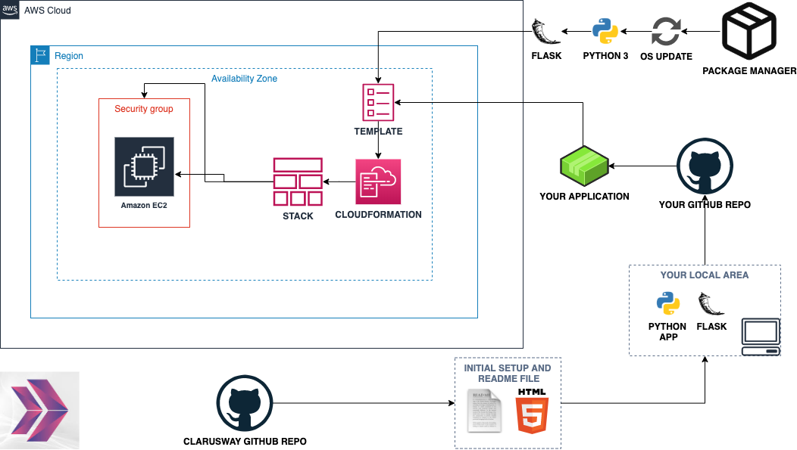

# Roman Numerals Converter Web Application (Python Flask) deployed on AWS EC2 with Cloudformation

This project provides a web application to convert **decimal numbers** into **Roman numerals**. The app is built using **Flask** and can be deployed easily using an **AWS CloudFormation template**.

---


## Features

- **Decimal to Roman Numeral Conversion**: Enter a decimal number, and the app will provide the corresponding Roman numeral equivalent.
- Simple, user-friendly interface for easy conversion.

---

## Project Skeleton 

```
001-roman-numerals-converter (folder)
|
|----readme.md         # Given to the students (Definition of the project)          
|----roman-num.yml     # To be delivered by students (Cloudformation template)
|----app.py            # To be delivered by students (Python Flask Web Application)
|----templates
        |----index.html  # Given to the students (HTML template)
        |----result.html # Given to the students (HTML template)
|----static
        |----mesudwork.jpg  # Given to the students (HTML template)
```

## Expected Outcome


---
## How to Deploy

You can deploy the web application using **AWS CloudFormation**. This will create an EC2 instance and automatically set up your Flask application.

### Steps to Deploy:

1. **Create a CloudFormation Stack**:
   
   - Go to the **AWS Management Console** and navigate to the **CloudFormation** service.
   - Click on **Create Stack** and choose **With new resources (standard)**.
   - Upload the provided CloudFormation template (`roman-num.yaml`) that is already attached to this repository. This template automates the deployment of your EC2 instance and Flask app.
   
2. **Configure Parameters**:
   - **AMI ID**: The template uses the latest Amazon Linux 2023 AMI by default. If needed, you can specify a different AMI ID.
   - **Key Pair**: Select an existing EC2 key pair or create a new one for SSH access to the instance.
   
3. **Launch the Stack**:
   - Once you've configured the parameters, click **Next** and then **Create**. AWS will provision the necessary resources, including an EC2 instance, security group, and other resources.
   
4. **Access the Application**:
   - After the stack is created, go to the **Outputs** section of the CloudFormation stack.
   - Copy the **WebsiteURL** output value. This is the URL of your running web application.
   - Open the URL in your browser to start using the **Roman Numerals Converter**.

---


## Resources

- [Python Flask Framework](https://flask.palletsprojects.com/en/1.1.x/quickstart/)

- [Python Flask Example](https://realpython.com/flask-by-example-part-1-project-setup/)

- [AWS Cloudformation User Guide](https://docs.aws.amazon.com/AWSCloudFormation/latest/UserGuide/Welcome.html)
